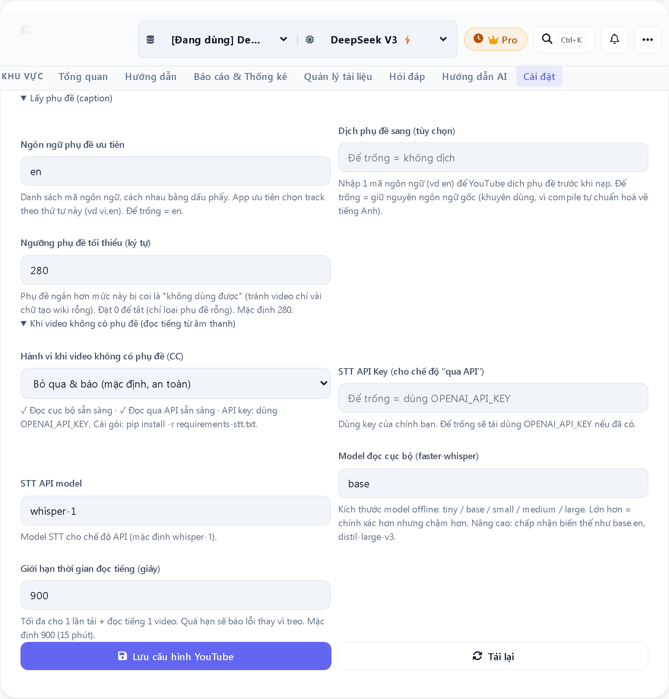
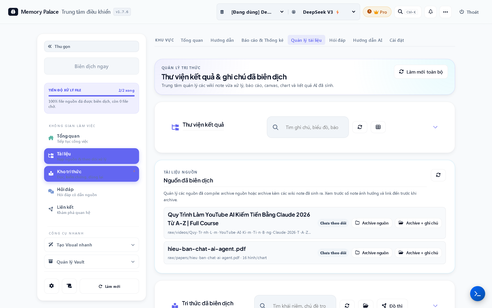

# Memory Palace

  

Local-first AI knowledge workspace for turning scattered documents into a structured, reusable Markdown wiki on your own computer.

Memory Palace is a commercial Windows desktop app by AlphaTech. This repository is a public product-information and support hub. It does not contain the application source code.

## What Memory Palace does

- Ingests PDFs, DOCX, TXT/Markdown, web pages, YouTube videos, GitHub repositories, and scanned documents.
- Compiles raw material into structured Markdown notes with links, summaries, concepts, and topics.
- Lets you ask questions against that compiled knowledge instead of prompting from scratch each time.
- Generates outputs from the curated wiki: reports, slide decks, PPTX, charts, and Canvas boards.
- Stores outputs as files you can open outside the app: Markdown, HTML, PPTX, `.canvas`, images.

## Why it exists

Most AI workflows still start from a blank chat box. Memory Palace takes a different path:

1. Collect source material.
2. Compile it into a clean local knowledge base.
3. Reuse that knowledge for writing, analysis, presentation, and review.

The goal is not to replace ChatGPT, Claude, Obsidian, or Notion. It is to connect messy source material to a repeatable personal knowledge workflow.

## Product boundaries

### Shipped now

- Windows 10/11 desktop app
- Local-first vault with standard Markdown outputs
- Obsidian-friendly workflow
- PDF/image OCR pipeline
- YouTube ingest with robust caption retrieval
- Optional speech-to-text fallback for videos without captions
- AI Skills for reports, slides, PPTX, charts, Canvas, research, review, and query workflows

### Important caveats

- Memory Palace is not a cloud note app.
- Memory Palace is not a team collaboration or cloud sync product.
- The app can call external AI providers that you configure.
- Some network activity is expected for source fetching, license/update checks, and provider API calls.
- macOS is not public-ready yet.

## Privacy model

Memory Palace is local-first:

- Your raw files, compiled wiki, and generated outputs live on your machine.
- Notes are plain files, not locked into a proprietary database.
- The app does not upload your document library to AlphaTech servers.

What may leave your machine:

- Prompts/content sent to the LLM provider you choose
- Source fetching from websites, YouTube, or GitHub when you ingest remote content
- License/update traffic required to run the desktop product

See [docs/PRIVACY.md](docs/PRIVACY.md) for the short public privacy summary.

## Obsidian relationship

Memory Palace works well with Obsidian, but it does not try to replace it.

- Memory Palace: ingest, compile, structure, generate
- Obsidian: read, edit, link, sync, and continue working with the resulting files

Outputs are Markdown and Canvas artifacts that stay useful even if you stop using the app.

## Screenshots

### App interface

### Source ingest and outputs

## Availability

- Platform: Windows 10/11 x64
- Trial: 15 days, full features
- Current public offer: Lifetime Personal - `1,250,000 VND`
- Refund: 30 days
- Purchase/support path: direct contact via landing page, Zalo, Telegram, or email

Current landing page:

- https://memorypalace.alphatech.ai.vn/

## Support

- Email: `alphatech.digitolead@gmail.com`
- Zalo: `https://zalo.me/0908695494`
- Telegram: `https://t.me/84908695494`

Start here:

- [SUPPORT.md](SUPPORT.md)
- [docs/FAQ.md](docs/FAQ.md)
- [docs/ROADMAP.md](docs/ROADMAP.md)

## Closed-source notice

Memory Palace is a commercial closed-source desktop product by AlphaTech.

This repository exists to:

- explain the product,
- show current capabilities,
- publish screenshots and public docs,
- provide support and security contact paths.

It does not include:

- application source code,
- installer binaries,
- private infrastructure,
- license secrets,
- customer data.

## Repository scope

This repo should stay limited to public-facing material:

- product overview,
- FAQ,
- privacy summary,
- roadmap,
- support/security contacts,
- screenshots.

If a future release flow uses GitHub Releases, that decision should be explicit and documented separately.
