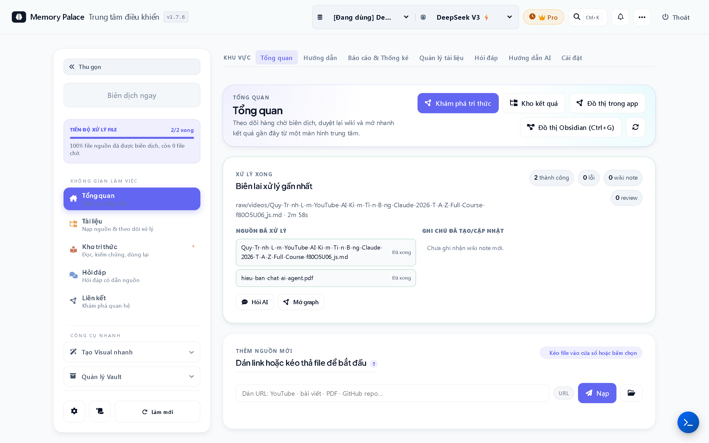
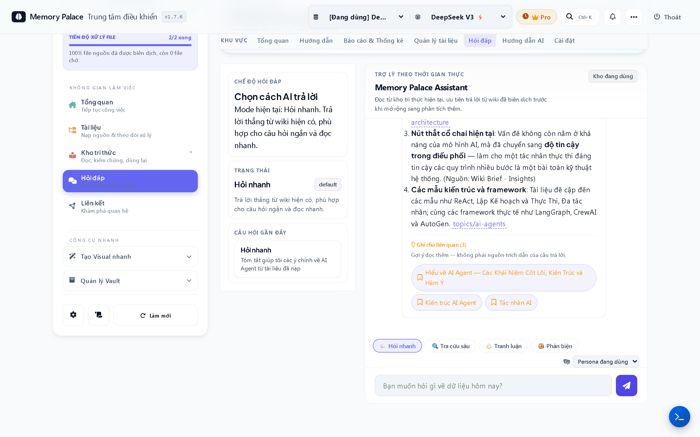
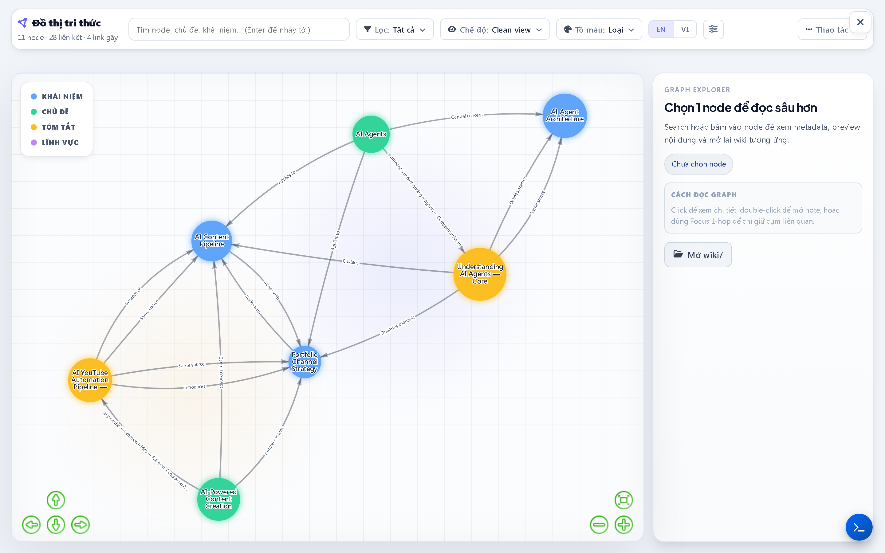
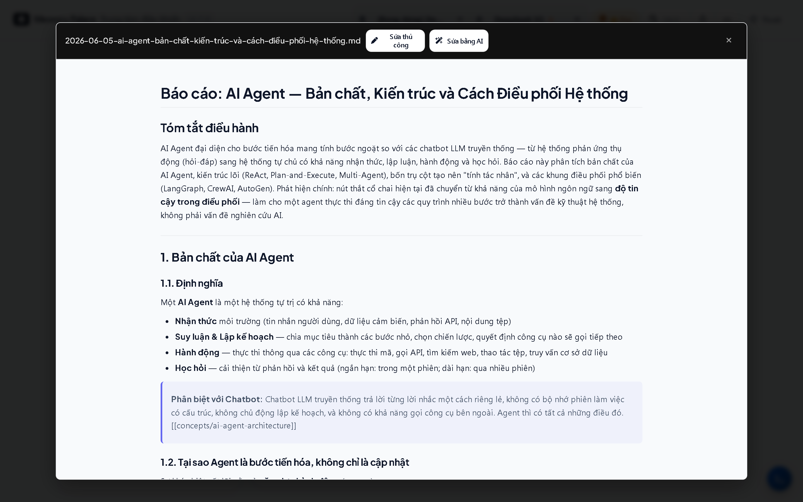
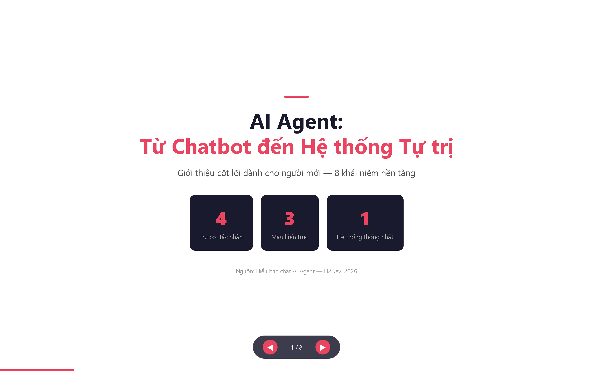
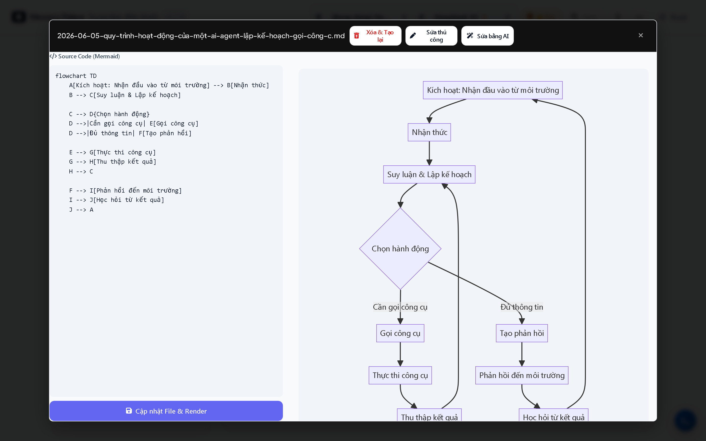
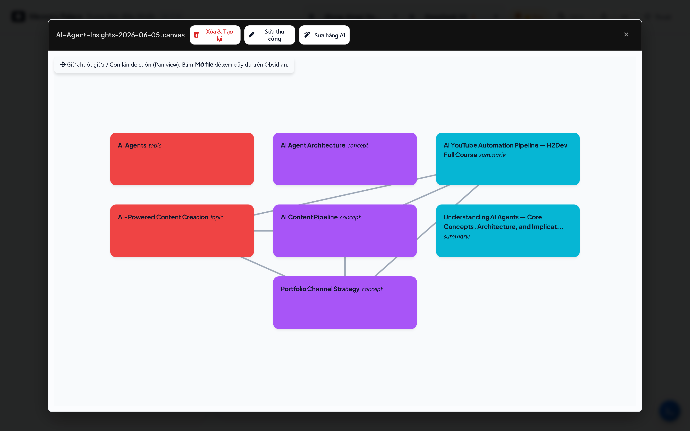

# Memory Palace

  

  

  <strong>Biến tài liệu rời rạc thành kho tri thức có thể tái sử dụng thật sự.</strong>

  Memory Palace là không gian làm việc AI local-first dành cho những người đọc nhiều, gom nhiều tài liệu,
  nhưng không muốn mỗi lần lại bắt đầu từ một ô chat trống.

  
  
  
  

  <a href="README.md"><strong>Read in English</strong></a> |
  <strong>Đọc bằng tiếng Việt</strong>

  <a href="https://memorypalace.alphatech.ai.vn/"><strong>Landing Page</strong></a>
  |
  <a href="SUPPORT.md"><strong>Hỗ trợ</strong></a>
  |
  <a href="docs/FAQ.md"><strong>FAQ</strong></a>

## Cú Chuyển Lớn

Phần lớn công cụ AI hiện nay vẫn bắt đầu bằng cùng một vòng lặp:

- Mở ô chat,
- Dán tài liệu lộn xộn,
- Nhận một câu trả lời tạm ổn,
- Mất luôn cấu trúc,
- Tuần sau làm lại từ đầu.

Memory Palace đi theo hướng khác.

Bạn nạp tài liệu, web, video, repo, bản scan. Ứng dụng biên dịch chúng thành một wiki Markdown sạch, nằm trên chính máy của bạn. Từ đó, bạn có thể hỏi lại, đào sâu, rà soát, rồi tạo báo cáo, slide, biểu đồ, canvas mà không phải dựng lại ngữ cảnh mỗi lần.

Điểm "wow" không chỉ là AI trả lời được.  
Điểm "wow" là tài liệu nguồn của bạn biến thành một workspace có thể dùng lại nhiều lần.

> Từ prompt dùng một lần sang cỗ máy tri thức có thể dùng lại.

## Vì Sao Trải Nghiệm Này Khác

1. **Gom** tài liệu nguồn còn lộn xộn.
2. **Biên dịch** thành tri thức có liên kết.
3. **Tái sử dụng** tri thức đó cho báo cáo, slide, chart, canvas và hỏi đáp.

Repository này là nơi công khai để giới thiệu sản phẩm và hỗ trợ người dùng cho ứng dụng Windows thương mại của AlphaTech. Nó không chứa source code của ứng dụng.

## Bạn Nhận Được Gì

- `📥` Nạp PDF, DOCX, TXT/Markdown, web page, video YouTube, GitHub repository và tài liệu scan
- `🧠` Biên dịch tài liệu thô thành ghi chú Markdown có liên kết, tóm tắt, concepts và topics
- `💬` Hỏi đáp trên chính kho tri thức đã biên dịch thay vì prompt lại từ đầu
- `🪄` Tạo báo cáo, slide deck, PPTX, chart và Canvas board từ cùng một nền tri thức
- `📂` Giữ kết quả dưới dạng file portable vẫn dùng được bên ngoài app

## Nhìn Nhanh

- `🏠` Ứng dụng desktop Windows, local-first
- `📝` Đầu ra là file Markdown chuẩn, giữ được lâu dài
- `🔗` Hợp với workflow Obsidian
- `🔍` OCR cho PDF, ảnh và tài liệu scan
- `🎬` Nạp YouTube với cơ chế lấy caption chắc hơn
- `🗣️` Có tùy chọn speech-to-text khi video không có caption đủ dùng
- `🧩` AI Skills để tạo báo cáo, slide, PPTX, chart, Canvas, research, review và query

## Xem Nhanh Giao Diện

  
  
  

  
  
  

## Dành Cho Ai

- `🎓` Sinh viên, researcher và người học tích lũy nhiều tài liệu nguồn
- `🧑‍💼` Analyst, consultant và knowledge worker cần đầu ra lặp lại được
- `✍️` Người viết và người làm nội dung muốn giữ ngữ cảnh bền vững thay vì chat thread dùng xong là bỏ
- `📚` Người dùng Obsidian muốn có một lớp ingest và structure mạnh hơn

## Memory Palace Làm Được Gì

- Nạp PDF, DOCX, TXT/Markdown, web page, video YouTube, GitHub repository và tài liệu scan
- Biên dịch tài liệu thô thành ghi chú Markdown có liên kết, tóm tắt, concepts và topics
- Cho phép hỏi đáp trên chính kho tri thức đã biên dịch thay vì prompt lại từ đầu
- Tạo đầu ra từ wiki đã được làm sạch: báo cáo, slide deck, PPTX, chart và Canvas board
- Lưu kết quả thành file có thể mở bên ngoài app: Markdown, HTML, PPTX, `.canvas`, hình ảnh

## Vì Sao Sản Phẩm Này Tồn Tại

Memory Palace không cố thay thế ChatGPT, Claude, Obsidian hay Notion.

Nó tập trung vào một bài toán hẹp hơn nhưng rất thực tế:

> "Tôi đã có tài liệu nguồn. Tôi cần một cách đáng tin để biến chúng thành tri thức có cấu trúc và đầu ra hữu ích, mà không phải dựng lại ngữ cảnh mỗi lần."

Nếu câu này đúng với nhu cầu của bạn, trải nghiệm sẽ khác hẳn một ứng dụng chat AI thông thường.

## Vì Sao Người Dùng Nhớ Nó

- `✨` Vì AI không còn mang cảm giác dùng xong là bỏ
- `🧭` Vì tài liệu nguồn lộn xộn được biến thành workflow có thể lặp lại
- `🏗️` Vì cấu trúc được tạo ra trước khi generate, không phải vá lại sau đó
- `💡` Vì nó tạo cảm giác "mình có thể xây tiếp từ đây" thay vì "mai lại làm lại từ đầu"

## Phạm Vi Sản Phẩm

### Đã có sẵn

- Ứng dụng desktop cho Windows 10/11
- Vault local-first với đầu ra Markdown chuẩn
- Workflow thân thiện với Obsidian
- OCR cho PDF và ảnh
- Nạp YouTube với cơ chế caption mạnh hơn
- Speech-to-text tùy chọn cho video không có phụ đề
- AI Skills cho báo cáo, slide, PPTX, biểu đồ, Canvas, research, review và query

### Lưu ý quan trọng

- Memory Palace không phải app ghi chú cloud
- Memory Palace không phải sản phẩm cộng tác nhóm hay đồng bộ cloud
- Ứng dụng có thể gọi các nhà cung cấp AI bên ngoài do bạn tự cấu hình
- Sẽ có một số network activity cho việc nạp nguồn, kiểm tra license/update và gọi provider API
- Bản macOS chưa sẵn sàng public

## Mô Hình Riêng Tư

Memory Palace là local-first:

- File gốc, wiki đã biên dịch và đầu ra tạo ra đều nằm trên máy của bạn
- Ghi chú là file chuẩn, không bị khóa trong database độc quyền
- Ứng dụng không tải cả thư viện tài liệu của bạn lên server AlphaTech

Những gì có thể rời khỏi máy:

- Prompt/nội dung gửi tới LLM provider mà bạn chọn
- Request lấy dữ liệu từ website, YouTube hoặc GitHub khi bạn nạp nguồn từ xa
- Lưu lượng cần thiết cho license/update của ứng dụng desktop

Xem thêm [docs/PRIVACY.md](docs/PRIVACY.md).

## Quan Hệ Với Obsidian

Memory Palace hợp với Obsidian, nhưng không cố thay thế Obsidian.

- Memory Palace: ingest, compile, structure, generate
- Obsidian: đọc, chỉnh sửa, liên kết, đồng bộ và tiếp tục làm việc với file kết quả

Markdown và Canvas output vẫn hữu ích kể cả khi bạn không dùng app nữa.

## Mở Bán Và Hỗ Trợ

- Nền tảng: Windows 10/11 x64
- Trial: 15 ngày, đầy đủ tính năng
- Mức giá public hiện tại: Lifetime Personal - `1,250,000 VND`
- Refund: 30 ngày
- Kênh mua/hỗ trợ: landing page, Zalo, Telegram hoặc email

Landing page:

- https://memorypalace.alphatech.ai.vn/

## Bắt Đầu Trong 3 Bước

1. **Gom** tài liệu nguồn: tài liệu, link, video, repository hoặc bản scan.
2. **Biên dịch** chúng thành kho tri thức Markdown local có cấu trúc.
3. **Tạo** báo cáo, slide, chart, canvas hoặc câu trả lời từ nền tri thức đó.

## Bắt Đầu Từ Đây

- `🌐` Landing page: https://memorypalace.alphatech.ai.vn/
- `🛟` Hướng dẫn hỗ trợ: [SUPPORT.md](SUPPORT.md)
- `❓` FAQ: [docs/FAQ.md](docs/FAQ.md)
- `🗺️` Roadmap: [docs/ROADMAP.md](docs/ROADMAP.md)

## Hỗ Trợ

- Email: `alphatech.digitolead@gmail.com`
- Zalo: `https://zalo.me/0908695494`
- Telegram: `https://t.me/84908695494`

## Bắt Đầu Dùng Thử

  <strong>Sẵn sàng biến tài liệu rời rạc thành một cỗ máy tri thức có thể dùng lại?</strong> 
  Hãy bắt đầu với bản dùng thử đầy đủ tính năng trong 15 ngày, hoặc liên hệ AlphaTech trực tiếp để được hỗ trợ và mua bản quyền.

  <a href="https://memorypalace.alphatech.ai.vn/"><strong>Mở Landing Page</strong></a>
  |
  <a href="SUPPORT.md"><strong>Liên hệ hỗ trợ</strong></a>

## Lưu Ý Closed-Source

Memory Palace là sản phẩm desktop thương mại closed-source của AlphaTech.

Repository này tồn tại để:

- Giới thiệu sản phẩm
- Cho thấy năng lực hiện tại
- Công bố screenshot và tài liệu public
- Cung cấp đầu mối hỗ trợ và security contact

Repository này không bao gồm:

- Source code ứng dụng
- Installer binary
- Hạ tầng private
- License secrets
- Dữ liệu khách hàng
